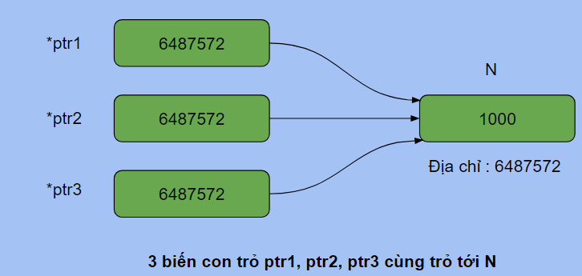

## Con trỏ trong Lập trình

Con trỏ là một khái niệm cơ bản nhưng vô cùng quan trọng trong lập trình. Chúng là một công cụ mạnh mẽ cho phép bạn thao tác trực tiếp với bộ nhớ, tăng hiệu suất và tạo ra các cấu trúc dữ liệu linh hoạt. Bài viết này sẽ giúp bạn hiểu rõ hơn về con trỏ và cách sử dụng chúng hiệu quả.

### 1. Con trỏ là gì?

Mỗi biến trong chương trình đều được cấp phát một vùng nhớ để lưu trữ giá trị của nó. Ví dụ, biến `int` được cấp phát 4 byte liên tiếp để lưu trữ giá trị nguyên và địa chỉ của byte đầu tiên được coi là địa chỉ của biến.

Con trỏ là một **biến lưu trữ địa chỉ bộ nhớ của một biến khác**. Hãy tưởng tượng con trỏ như một mẩu giấy ghi địa chỉ nhà của bạn, thay vì ghi chính tên nhà.

**Ví dụ:**

```c
int *ptr; // Khai báo một con trỏ có tên là ptr, trỏ đến kiểu dữ liệu int
int a = 5;
ptr = &a; // Gán địa chỉ của biến a cho ptr
```

Trong ví dụ này, `a` có kiểu dữ liệu `int` nên cần có một con trỏ có kiểu `int` để lưu trữ giá trị địa chỉ của `a`.

### 2. Địa chỉ tham chiếu và giải tham chiếu

- **Địa chỉ tham chiếu**: Dấu `&` được sử dụng để lấy địa chỉ của một biến. Ví dụ, `&a` sẽ trả về địa chỉ của biến `a`.
- **Giải tham chiếu**: Dấu `*` được sử dụng để truy cập giá trị tại địa chỉ mà con trỏ đang trỏ tới. Ví dụ, `*ptr` sẽ trả về giá trị của biến `a` (5) vì `ptr` đang trỏ đến địa chỉ của `a`.



### 3. Ưu điểm của con trỏ

- **Hiệu suất:** Con trỏ cho phép thao tác trực tiếp với bộ nhớ, giúp tăng tốc độ xử lý.
- **Cấp phát động:** Con trỏ cho phép cấp phát động bộ nhớ, tạo ra các cấu trúc dữ liệu linh hoạt như `LinkedList`.
- **Truyền tham chiếu:** Con trỏ cho phép truyền tham chiếu cho hàm, thay đổi giá trị biến ban đầu.
- **Tạo các cấu trúc dữ liệu nâng cao:** Con trỏ là nền tảng của các cấu trúc dữ liệu phức tạp như cây, đồ thị, v.v.

### 4. Con trỏ và hàm

Con trỏ có thể được sử dụng như tham số cho hàm để:

- **Truyền tham chiếu:** Thay đổi giá trị của biến ban đầu.
- **Trả về giá trị của con trỏ:** Trả về địa chỉ của một biến hoặc vùng bộ nhớ.

**Ví dụ 1: Thay đổi giá trị của biến sau khi hàm kết thúc**

```c
void change(int *x){
    printf("Giá trị của con trỏ x : %d\n", x);
    printf("Giá trị của biến mà x đang trỏ tới : %d\n", *x);
    *x = 1000; // Thay đổi giá trị của biến mà x đang trỏ tới
}

int main(){
    int N = 28;
    printf("Địa chỉ của N : %d\n", &N);
    change(&N); // Truyền địa chỉ của N vào
    printf("Giá trị của N : %d\n", N); // N đã được thay đổi thành 1000
    return 0;
}
```

**Ví dụ 2: Hoán đổi giá trị của 2 biến**

```c
void swap(int *x, int *y){
    int tmp = *x;
    *x = *y;
    *y = tmp;
}

int main(){
    int a = 100, b = 200;
    swap(&a, &b);
    printf("%d %d\n", a, b); // a = 200, b = 100
    return 0;
}
```

Hàm `swap` nhận hai con trỏ `a` và `b` trỏ đến hai biến `x` và `y`. Bằng cách giải tham chiếu, hàm `swap` đổi giá trị của `x` và `y` trực tiếp.

### 5. Lưu ý

- **Sử dụng con trỏ cần thận trọng vì thao tác trực tiếp với bộ nhớ có thể dẫn đến lỗi nghiêm trọng.**
- **Con trỏ `null` (nullptr) là một con trỏ không trỏ đến bất kỳ vị trí bộ nhớ nào.**
- **Tránh giải tham chiếu con trỏ `null` vì điều này có thể dẫn đến lỗi phân đoạn.**

### 6. Con trỏ so với Tham chiếu

**Tham chiếu (Reference):**

- Là một **biến định danh (alias)** cho một biến đã tồn tại.

- **Không chiếm bộ nhớ riêng biệt** để lưu trữ tham chiếu. Thay vào đó, nó chỉ là một cách gọi khác cho cùng vùng nhớ của biến gốc.
- **Không thể thay đổi**: Khi đã được khởi tạo, tham chiếu sẽ luôn trỏ đến biến gốc ban đầu và không thể được gán lại để trỏ đến biến khác.
- **Sử dụng**: Thường được sử dụng để truyền đối số vào hàm theo tham chiếu (pass by reference) để thay đổi trực tiếp giá trị của biến gốc.

**Con trỏ (Pointer):**

- Là một **biến riêng biệt** lưu trữ **địa chỉ** của một biến khác.
- **Chiếm bộ nhớ riêng biệt** để lưu trữ địa chỉ đó.
- **Có thể thay đổi**: Con trỏ có thể được gán lại để trỏ đến một địa chỉ khác trong quá trình thực thi chương trình.
- **Sử dụng**: Được sử dụng để thao tác trực tiếp với bộ nhớ, tạo các cấu trúc dữ liệu động, quản lý các đối tượng động, v.v.

```c
int main() {
    int a = 10; // Biến gốc

    // Tham chiếu
    int& ref = a; // ref là một alias của a

    // Con trỏ
    int *ptr = &a; // ptr lưu trữ địa chỉ của a

    std::cout << "Giá trị của a: " << a << std::endl; // Giá trị của a: 10
    std::cout << "Giá trị của ref: " << ref << std::endl; // Giá trị của ref: 10
    std::cout << "Giá trị của *ptr: " << *ptr << std::endl; // Giá trị của *ptr: 10
    std::cout << "Địa chỉ của a: " << &a << std::endl; // Địa chỉ của a: 0x...
    std::cout << "Địa chỉ của a mà ptr quản lý: " << ptr << std::endl; // Địa chỉ của ptr: 0x... (giống với địa chỉ của a)

    ref = 20; // Thay đổi giá trị của a thông qua ref
    *ptr = 30; // Thay đổi giá trị của a thông qua ptr

    std::cout << "Giá trị mới của a: " << a << std::endl;
    return 0;
}
```

**Bảng so sánh chi tiết:**

| Đặc điểm             | Tham chiếu (Reference)                                       | Con trỏ (Pointer)                             |
| -------------------- | ------------------------------------------------------------ | --------------------------------------------- |
| **Khái niệm**        | Bí danh của một biến đã tồn tại                              | Biến lưu trữ địa chỉ                          |
| **Kích thước**       | Không chiếm bộ nhớ riêng                                     | Chiếm bộ nhớ để lưu trữ địa chỉ               |
| **Thay đổi địa chỉ** | Không                                                        | Có thể thay đổi                               |
| **Dereferencing**    | Không cần                                                    | Cần dấu sao (\*)                              |
| **Khởi tạo**         | Phải được khởi tạo ngay từ đầu                               | Có thể khởi tạo hoặc gán sau                  |
| **Sự linh hoạt**     | Ít linh hoạt hơn                                             | Linh hoạt hơn                                 |
| **Sử dụng**          | Truyền tham chiếu vào hàm, tạo các cấu trúc dữ liệu đơn giản | Tạo các cấu trúc dữ liệu động, quản lý bộ nhớ |

**Lưu ý:**

- Tham chiếu là một cách đơn giản hóa để làm việc với các biến đã tồn tại, giúp mã dễ đọc hơn và giảm lỗi.
- Con trỏ mang lại nhiều tính linh hoạt hơn nhưng cũng tiềm ẩn nguy cơ lỗi cao hơn nếu sử dụng không đúng cách, ví dụ như truy cập vào vùng nhớ không hợp lệ (dangling pointer).

### 7. Con trỏ và lỗi thường gặp

- **Dangling pointer:** Con trỏ trỏ đến một vùng nhớ đã được giải phóng (freed). Điều này có thể xảy ra khi bạn giải phóng vùng nhớ mà một con trỏ vẫn đang trỏ đến.
- **Memory leak:** Vùng nhớ đã được cấp phát nhưng không được giải phóng sau khi sử dụng. Điều này xảy ra khi bạn quên giải phóng vùng nhớ hoặc có lỗi trong việc quản lý bộ nhớ.
- **Access violation:** Truy cập vào vùng nhớ không hợp lệ. Điều này có thể xảy ra khi bạn giải tham chiếu một con trỏ null hoặc một con trỏ trỏ đến một vùng nhớ không thuộc quyền sở hữu của bạn.

### 8. Kết luận

Con trỏ là một khái niệm nâng cao, nhưng rất hữu ích trong lập trình. Hiểu rõ về con trỏ và cách sử dụng chúng một cách hiệu quả sẽ giúp bạn viết các chương trình hiệu quả và linh hoạt hơn.
